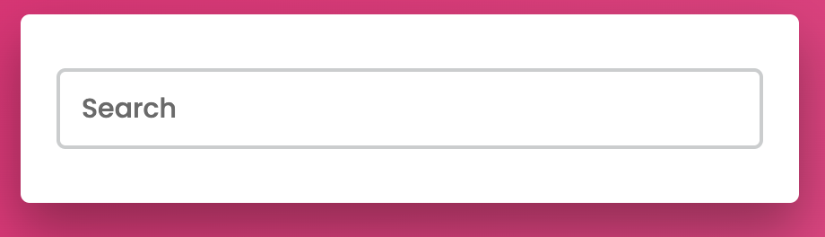

# ToDo List

Build a React ToDo List application according to the design on the demo below.

### User scenarios

- As a user I want to add a new todo item
- As a user I want to mark a todo item as done without deleting it
- As a user I want to delete a todo item
- As a user I want to close the todo list app without losing the data

### Requirements

- Responsive
- Saves the data locally
- Uses React

### Bonus points

- Search feature 
- Sort feature
- Tests

### Other notes

- Gradient colors are: #dc2873 and #e66b9e

### How to submit

Please send us your assignment by sharing a link to your repository.
Spend a maximum of 24 hours on this assignment. If you feel like there is something missing, just describe what you would've done in your README file. Write your code as if it were production code.
You are free to use any 3rd party tools that you think might be usefull.
